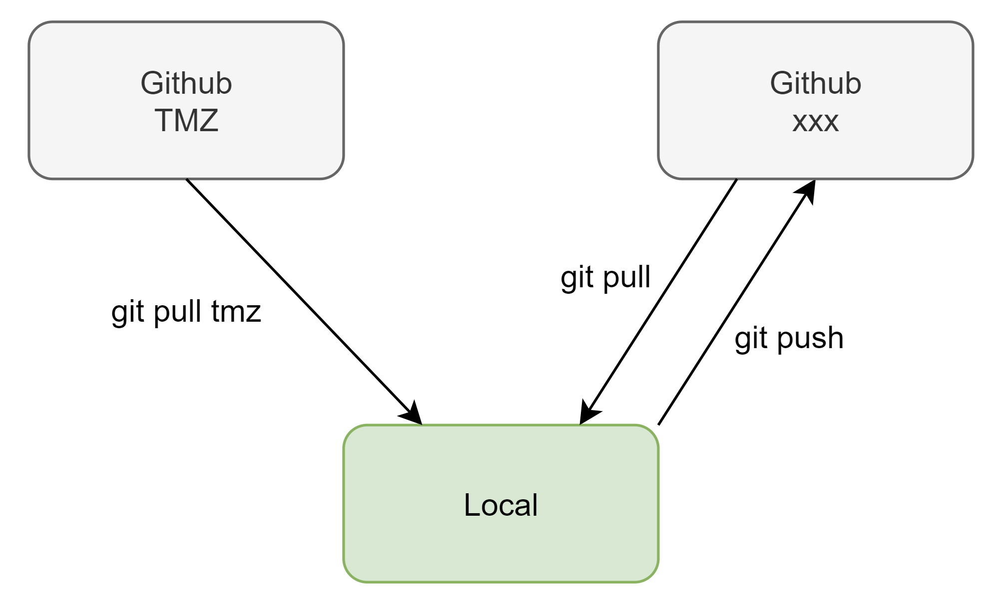

# Description

# Récupération des sources
- créer ou aller dans un répertoire de travail
- cloner les fichiers : `git clone -o tmz`
- créer un repository dans votre compte github
- copier le lien du repository
- ajouter une nouvelle remote dans le répertoire local : `git remote add origin <repo link>`
- pousser les fichiers dans votre repository : `git push -u origin master`

# Récupérer les modification du repo TMZ
- `git pull tmz`

# Pousser les modifications dans votre repo
- `git commit -am "<message>`
- `git push`

# Ajouter de nouveaux fichiers
- `git add .`
- `git commit -am "<message>`
- `git push`

# Exécution de la base de données
- avec une console aller dans le répertoire local
- `docker-compose up -d`

# Datagrip
### Ouverture des fichiers sql
- ouvrir Datagrip
- File -> Attach directory to project
- Exécuter le code dans les fichiers

### Exécution des scripts
Pour tester des requêtes, utiliser la console.
Pour du code finale, utiliser les fichiers sql (vous pouvez en créer des nouveaux).